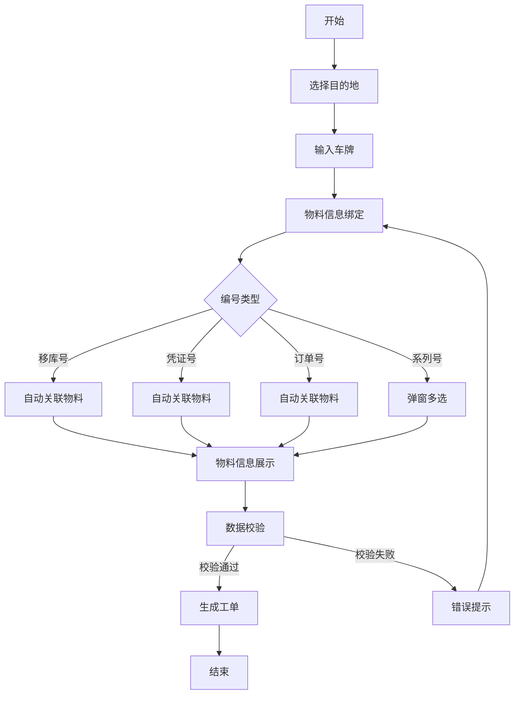
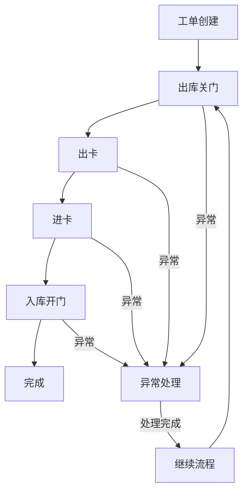
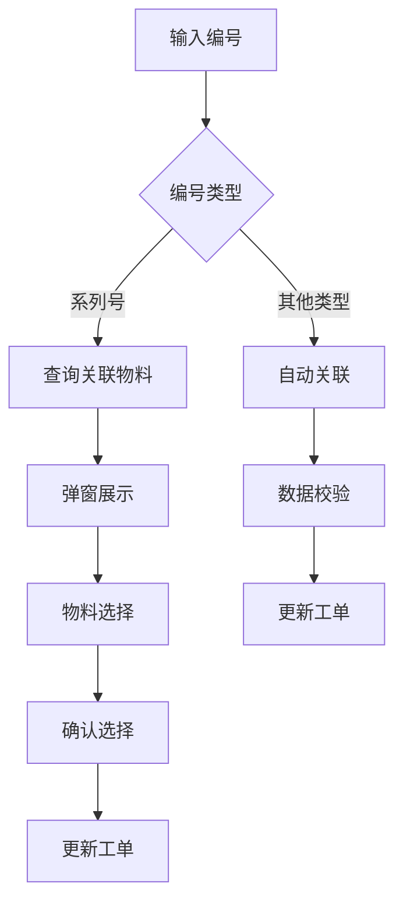
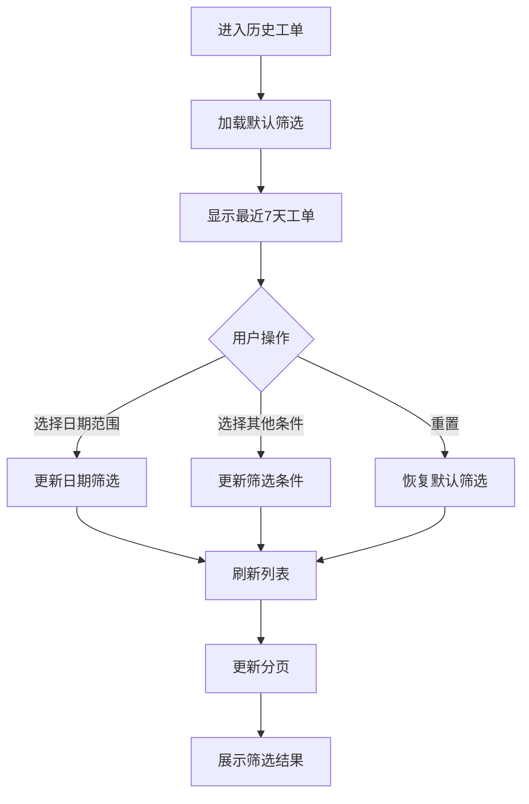

# 一司两地业务系统 PRD

## 1. 背景与目标
本系统用于支撑一司两地（如浦东基地与大场基地）之间的物料移库、运输、流转等业务场景，实现工单全流程数字化、可追溯，提升业务效率与透明度。系统需同时适配移动端和PC端，满足现场操作与后台管理需求。

## 2. 业务场景与用户角色
### 2.1 用户角色
1. **现场操作人员**
   - 负责扫码、确认物料信息
   - 主要在移动端操作
   - 关注点：操作便捷性、响应速度

2. **仓库管理人员**
   - 负责物料出入库确认
   - 主要在PC端操作
   - 关注点：数据准确性、异常处理

3. **运输管理人员**
   - 负责车辆调度、运输跟踪
   - 主要在PC端操作
   - 关注点：运输状态、时效性

### 2.2 典型业务场景
1. **正常移库场景**
   ```
   开始
   ↓
   创建工单 → 选择目的地 → 输入车牌
   ↓
   物料信息绑定
   ├→ 输入移库号 → 自动关联物料
   ├→ 输入凭证号 → 自动关联物料
   ├→ 输入订单号 → 自动关联物料
   └→ 输入系列号 → 弹窗多选物料
   ↓
   确认提交 → 生成工单
   ↓
   出库关门 → 出卡 → 进卡 → 入库开门
   ↓
   完成
   ```

2. **异常处理场景**
   ```
   开始
   ↓
   发现异常
   ├→ 物料信息不完整 → 补充信息
   ├→ 数量不匹配 → 确认实际数量
   ├→ 系统异常 → 本地缓存
   └→ 网络异常 → 离线操作
   ↓
   异常确认
   ├→ 自动处理
   └→ 人工干预
   ↓
   继续流程
   ```

## 3. 详细业务流程
### 3.1 工单创建流程


### 3.2 工单流转流程


### 3.3 物料信息绑定流程


## 4. 业务规则与约束
### 4.1 工单规则
1. **创建规则**
   - 目的地必选
   - 车牌号必填且格式正确
   - 至少绑定一个物料信息
   - 工单编号自动生成，格式：YYYYMMDD-XXX

2. **流转规则**
   - 节点顺序固定：创建→出库关门→出卡→进卡→入库开门→完成
   - 每个节点必须记录操作时间
   - 异常节点需要记录原因和处理方式

3. **物料规则**
   - 移库号/凭证号/订单号：自动关联全部物料
   - 系列号：支持多选，可跨批次
   - 物料数量只读，由系统自动关联
   - 支持按编号类型筛选显示

### 4.2 异常处理规则
1. **系统异常**
   - 网络异常：本地缓存，恢复后自动同步
   - 数据冲突：提示用户确认
   - 接口超时：自动重试，最多3次

2. **业务异常**
   - 物料信息不完整：提示补充
   - 数量不匹配：记录差异，等待确认
   - 节点异常：记录原因，支持回退

## 5. 主要业务流程
1. **工单创建**
   - 用户选择目的地、填写货车车牌。
   - 物料信息绑定：
     a. 支持四种编号类型输入：
        - 移库号：系统自动关联该移库号下的所有物料信息
        - 49号凭证号：系统自动关联该凭证号下的所有物料信息
        - 订单号：系统自动关联该订单号下的所有物料信息
        - 系列号：输入后弹出物料选择弹窗，支持多选
     
     b. 系列号多选逻辑：
        - 输入系列号后，系统查询该系列号关联的所有物料
        - 弹窗展示物料列表，包含：物料编码、名称、规格、单位、数量
        - 支持以下操作：
          * 全选/取消全选
          * 单个物料选择/取消选择
          * 已选物料数量实时统计
          * 支持搜索过滤
          * 支持分页加载
        - 确认选择后，将选中的物料信息添加到工单中
     
     c. 物料信息展示：
        - 每个编号类型独立展示，支持多个编号同时存在
        - 物料表格字段：
          * 编号类型（移库号/凭证号/订单号/系列号）
          * 编号值
          * 物料编码
          * 物料名称
          * 规格
          * 单位
          * 数量（只读，系统自动关联）
          * 操作（支持删除单个物料）
        - 支持按编号类型筛选显示
        - 支持物料信息导出

     d. 数据校验：
        - 编号格式校验
        - 物料信息完整性校验
        - 重复物料校验
        - 必填项校验

     e. 异常处理：
        - 编号不存在时提示
        - 物料信息获取失败时重试
        - 网络异常时本地缓存
        - 数据冲突时提示用户确认
2. **工单流转节点**
   - 创建
   - 出库关门
   - 出卡（海关系统同步）
   - 进卡（海关系统同步）
   - 入库开门（即工单完成，时间与完成节点一致）
3. **历史工单管理**
   - 支持查看所有历史工单。
   - 首页卡片仅展示工单编号、目的地、车牌、创建时间、当前环节、当前状态。
   - 详情页展示物料清单、业务流程进度（流程条）、关键时间节点（时间线）。

## 6. 主要界面与交互
- **首页/工单创建页**
  - 顶部标题：一司两地业务系统
  - 支持选择目的地、输入车牌、物料信息绑定（支持多类型编号，系列号弹窗多选物料）
  - 工单提交后自动进入历史工单管理

- **历史工单列表页**
  - 筛选功能：
    * 日期范围筛选
      - 支持快速选择：今天、昨天、最近7天、最近30天、本月、上月
      - 支持自定义日期范围（开始日期-结束日期）
      - 日期选择器支持日历视图和手动输入
      - 默认显示最近7天的工单
    * 高级筛选
      - 工单状态筛选（全部、进行中、已完成、异常）
      - 目的地筛选
      - 车牌号筛选
      - 工单编号筛选
    * 筛选条件组合
      - 支持多个条件组合筛选
      - 支持保存常用筛选条件
      - 支持重置筛选条件
  - 列表展示：
    * 卡片式展示，字段：工单编号、运输目的地、货车车牌、创建时间、当前环节、当前状态
    * 支持列表/卡片视图切换
    * 支持按创建时间正序/倒序排序
    * 支持分页加载，每页20条
    * 支持导出当前筛选结果
  - 交互优化：
    * 筛选条件变更时自动刷新列表
    * 加载状态显示
    * 无数据时显示友好提示
    * 支持下拉刷新
    * 支持触底加载更多
  - 点击卡片进入详情页

- **工单详情页**
  - 展示工单基础信息、物料清单
  - 用 antd Steps 展示业务流程进度（创建→出库关门→出卡→进卡→入库开门→完成）
  - 用 antd Timeline 展示关键时间节点
  - 无拍照记录展示

### 6.1 历史工单筛选流程


### 6.2 筛选条件数据结构
```typescript
interface FilterCondition {
  dateRange: {
    startDate: string;  // YYYY-MM-DD
    endDate: string;    // YYYY-MM-DD
  };
  status?: string[];    // 工单状态
  destination?: string[]; // 目的地
  truckNumber?: string;  // 车牌号
  orderCode?: string;    // 工单编号
  pageSize: number;      // 每页条数
  currentPage: number;   // 当前页码
  sortField: string;     // 排序字段
  sortOrder: 'asc' | 'desc'; // 排序方向
}
```

### 6.3 性能优化
1. **数据加载优化**
   - 首次加载只获取最近7天数据
   - 分页加载，避免一次性加载过多数据
   - 支持数据预加载，提升翻页体验

2. **筛选性能优化**
   - 筛选条件变更时防抖处理
   - 支持本地缓存筛选条件
   - 大数据量时使用虚拟滚动

3. **缓存策略**
   - 缓存常用筛选结果
   - 定期清理过期缓存
   - 支持手动刷新数据

## 7. PC端与移动端适配
- **移动端**：窄屏、单列布局，按钮大、表单简洁，适合现场扫码与操作。
- **PC端**：宽屏、表格与卡片更大，适合后台管理与批量操作。
- 路由区分：/biz/index.tsx（移动端），/biz/pc.tsx（PC端）

## 8. 数据结构简述
- 工单：
  - code（工单编号）、dest（目的地）、truck（车牌）、materials（物料清单）、status（状态）、各节点时间（time、customsOutTime、customsInTime等）
- 物料：
  - code、name、spec、unit、qty
- 支持多种编号类型（移库号、凭证号、订单号、系列号）

## 9. 可扩展点
- 对接真实WMS/SAP/MOM等系统接口，自动同步物料与节点状态
- 支持扫码枪、拍照、电子签名等移动端原生能力
- 工单导出、批量管理、权限控制
- 流程节点自定义、异常处理、消息推送等

---
> 本文档基于当前一司两地业务系统实现撰写，后续如有新需求请补充修订。 